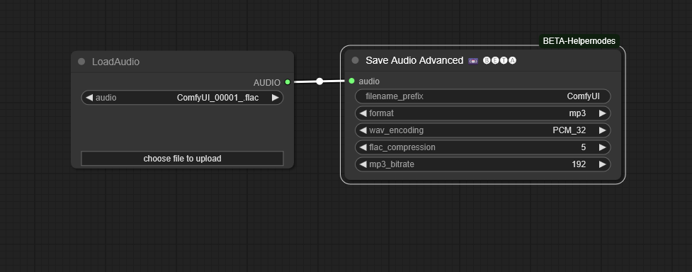

# ComfyUI-BETA-Helpernodes

[](https://opensource.org/licenses/MIT)

Custom utility nodes for [ComfyUI](https://github.com/comfyanonymous/ComfyUI), providing helpers for tasks like video frame manipulation and advanced audio saving. Part of the "Burgstall Enabling The Awesomeness" suite.

*(Previously known as ComfyUI-BETA-Cropnodes)*

## Nodes

*   **Video Crop 📼 🅑🅔🅣🅐**: Crops a specified rectangular region from each frame in a batch of images (video frames). Includes an option to round the crop dimensions up to the nearest multiple.
*   **Video Stitch 📼 🅑🅔🅣🅐**: Stitches a batch of previously cropped frames back onto a batch of original frames using metadata provided by the Crop node.
*   **Save Audio Advanced 🔊 🅑🅔🅣🅐**: Saves audio data (received in ComfyUI's standard AUDIO format, or common dictionary formats) to disk as FLAC, WAV, or MP3, with format-specific quality/compression options.

## Features

*   Simple cropping of video frame batches.
*   Ability to round crop width and height up to the nearest multiple (e.g., 8, 16, 32).
*   Outputs crop information (`BETA_CROPINFO`) needed for precise stitching.
*   Stitches processed crops back into their original positions on the full frames.
*   Advanced audio saving to **FLAC**, **WAV**, or **MP3**.
*   Configurable options for WAV encoding (bit depth) and FLAC compression level.
*   MP3 saving uses the backend's default bitrate settings (user bitrate input currently ignored due to backend API limitations). *[Note: We may revisit MP3 bitrate control if torchaudio API stabilizes]*
*   Handles multiple common AUDIO input formats (standard tuple, wrapped dictionary, plain dictionary).
*   Uses ComfyUI's standard output directory and filename prefixing for saved audio.
*   Handles potential dimension mismatches and boundary conditions gracefully (for video nodes).

## Installation

1.  Navigate to your ComfyUI `custom_nodes` directory:
    *   Example: `ComfyUI/custom_nodes/`
2.  Clone this repository:
    ```bash
    git clone https://github.com/Burgstall-labs/ComfyUI-BETA-Helpernodes.git
    ```
    *(Assuming this is the final repository location)*
3.  Restart ComfyUI.

Alternatively, you can download the `.zip` of this repository and extract the `ComfyUI-BETA-Helpernodes` folder into your `ComfyUI/custom_nodes/` directory.

## Dependencies

*   Requires a standard ComfyUI installation (PyTorch, Torchaudio).
*   **MP3 Saving Requirement:** Saving to `.mp3` requires **FFmpeg** (usually including `libmp3lame`) to be installed on your system and accessible in the system's PATH. WAV and FLAC saving do not require external dependencies beyond torchaudio.

## Usage

### Video Crop 📼 🅑🅔🅣🅐

This node takes a batch of images and crops them.

**Inputs:**

*   `video_frames` (IMAGE): The batch of images (video frames) to crop.
*   `x` (INT): The horizontal starting coordinate (left edge) of the crop area (0-indexed).
*   `y` (INT): The vertical starting coordinate (top edge) of the crop area (0-indexed).
*   `width` (INT): The desired width of the crop area.
*   `height` (INT): The desired height of the crop area.
*   `round_to_multiple` (INT): Rounds the `width` and `height` *up* to the nearest multiple of this value. Set to `1` to disable rounding.

**Outputs:**

*   `cropped_frames` (IMAGE): The batch of cropped images.
*   `crop_info` (BETA_CROPINFO): Metadata used by the Stitch node.

### Video Stitch 📼 🅑🅔🅣🅐

This node takes original frames and cropped frames and puts the cropped section back.

**Inputs:**

*   `original_frames` (IMAGE): The original, uncropped batch of images.
*   `cropped_frames` (IMAGE): The batch of cropped images (e.g., after processing).
*   `crop_info` (BETA_CROPINFO): The output from the `Video Crop` node.

**Outputs:**

*   `stitched_frames` (IMAGE): The original frames with the `cropped_frames` stitched back.

### Save Audio Advanced 🔊 🅑🅔🅣🅐

Saves audio data (waveform and sample rate) to a file in the chosen format.

**Inputs:**

*   `audio` (AUDIO): The audio data coming from another node (e.g., TTS, Load Audio). Accepts standard `(tensor, rate)` tuple or common `{'waveform': tensor, 'sample_rate': rate}` dictionary formats.
*   `filename_prefix` (STRING): Prefix for the output filename (e.g., "output_audio"). ComfyUI adds date/counters automatically.
*   `format` (STRING): The desired output format. Choose from `flac`, `wav`, `mp3`.
*   `wav_encoding` (STRING, *optional*): For `wav` format. Selects the encoding and bit depth (e.g., `PCM_16`, `PCM_24`, `FLOAT_32`). Defaults to `PCM_16`.
*   `flac_compression` (INT, *optional*): For `flac` format. Sets the compression level (0=fastest, lowest compression; 8=slowest, highest compression). Defaults to `5`.
*   `mp3_bitrate` (INT, *optional*): *(Currently ignored)* Intended to set MP3 bitrate. Uses backend default due to API issues.

**Outputs:**

*   *(Saves file to disk in the ComfyUI `output` directory. Provides UI feedback with filename.)*

## Example Workflows

### Save Audio Advanced Example

This workflow demonstrates using the `Save Audio Advanced` node to save the output of a TTS (Text-to-Speech) node.



*(workflow.png located in the repository root)*

### Video Crop / Stitch Example (Face Analysis / Latent Sync)

This example shows how `Video Crop` and `Video Stitch` can be used in a more complex workflow, such as isolating a face identified by FaceAnalysis, processing it (e.g., with IPAdapter or LatentSync techniques), and then stitching the modified face back into the original video frames.

.png)

*(workflow(1).png located in the repository root)*


## License

This project is licensed under the MIT License - see the [LICENSE](LICENSE) file for details.

## Acknowledgements

*   The ComfyUI team for creating an amazing tool.
*   Kosinkadink for making the awesome VideoHelperSuite (**https://github.com/Kosinkadink/ComfyUI-VideoHelperSuite**) that inspired the naming of the original crop nodes.
